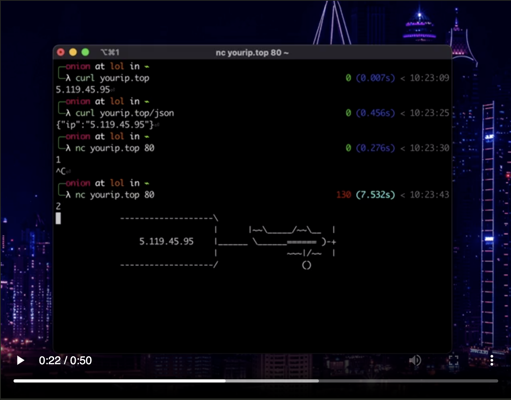

# YourIP Server

YourIP Server is a TCP server written in Go that returns the client's IP address. It supports various response modes, including tcp plain text, HTTP plain text, and HTTP JSON. Additionally, it features a fun IP streaming animation.

You can access the YourIP Server at [yourip.top](http://yourip.top).


## Run Server:

### Method One:


```bash
make
```
```bash
./yourip 'host:port'
```

Replace `'host:port'` with the desired host and port to listen on.

For example:

```bash
./yourip :8080
```

### Method Two:

```bash
go run main.go 'host:port'
```

Replace `'host:port'` with the desired host and port to listen on.

## How it works

The server uses the `net` package in Go to resolve the TCP address, start a listener, and accept incoming connections. It sets a deadline of one minute for each connection and responds with an HTTP 200 OK message containing the client's IP address.

## Response Modes

- **Plain Text:** Suitable for pure TCP connections like NetCat.
    * Netcat: `echo -e "" | nc yourip.top 80`
- **HTTP Text:** Designed for browsers and `curl` requests.
    * Curl: `curl http://yourip.top`
    * Open this addres on browser `http://yourip.top`
    * Netcat: `echo -e "GET /" | nc yourip.top 80`
- **HTTP JSON:** Designed for browsers and `curl` requests. 
    * Curl: `curl http://yourip.top/json`
    * Open this addres on browser `http://yourip.top`
    * Netcat: `echo -e "GET /json" | nc yourip.top 80`
- **Animation:** Suitable for pure TCP connections like NetCat.
    * Netcat: `echo -e "1" | nc yourip.top 80` (Banner)
    * Netcat: `echo -e "2" | nc yourip.top 80` (Flight)

## Animation Mode

The server can stream the client's IP address in an animated format.\
for example connect to the server with netcat (`nc`) and send `1` or `2`
 or use these commands: \
 `echo -e "1" | nc yourip.top 80` \
 `echo -e "2" | nc yourip.top 80` 

[](./docs_file/example.mp4)

## License

This project is licensed under the [MIT License](https://github.com/onionj/ip/blob/master/LICENSE).

